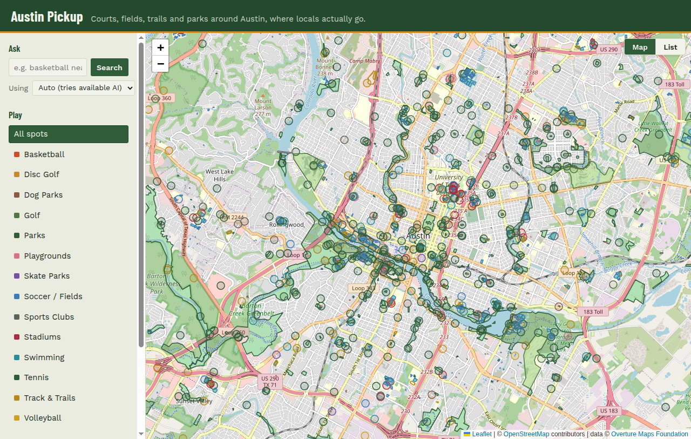
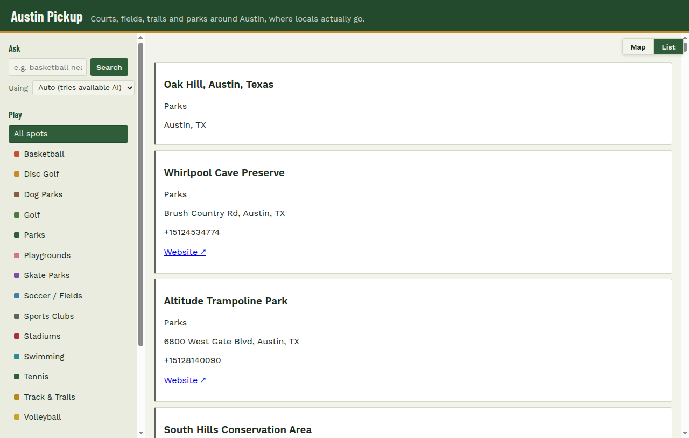
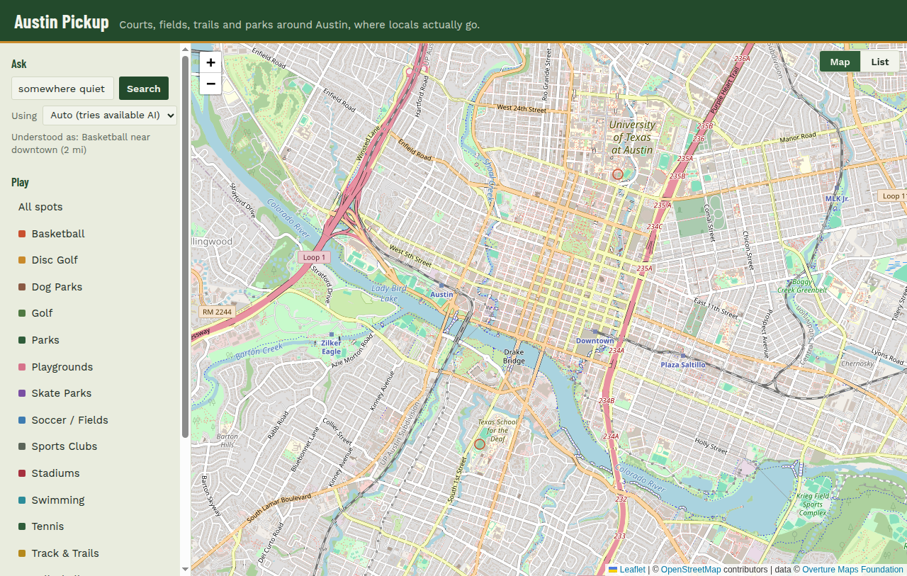

# AUSTIN PICKUP

[](https://github.com/pre-commit/pre-commit)
[](https://github.com/psf/black)
[](https://github.com/timothycrosley/isort)
[](https://www.python.org/)
[](docs/architecture.md)
[](https://claude.com/claude-code)

**About**

A map of free places to play in central Austin: basketball courts, dog parks, disc golf, pickleball, trails, and more, built on Overture Maps data. Commercial-venue apps like Yelp and Google are built around businesses, so this kind of public infrastructure is usually missing, buried, or miscategorized on them. Comes with a natural-language search bar, an LLM (Gemini, Groq, Mistral, Anthropic, or OpenAI, whichever the server has a key for) turns a plain-English query into the same map filters.

**Screenshots**

| Map | List |
|---|---|
|  |  |

Natural-language search, parsed by AI into the same category/location filters used by the sidebar:



## What it does

- A single map of central Austin, filterable by activity (basketball, tennis, soccer/fields, dog parks, skate parks, disc golf, pickleball, trails, swimming, playgrounds, general parks, and a few more)
- "Use my location" for a real near-me radius search, not just a static city-wide view
- A natural-language search bar ("somewhere quiet to play basketball near downtown") parsed by an LLM into the same category/location filters, see [Settings](#settings) below
- A map/list toggle, so results can be browsed as cards instead of pins

## How it's built

- **Data pipeline** (`scripts/`): a one-time extraction (`01_download_raw.sh`, using the `overturemaps` CLI) pulls Places and Land Use for the Austin bounding box. `02_filter_and_build.py` filters that down to sport/recreation features and writes one small `data/austin_sports.geojson`, the only file the running app depends on, matching the spirit of Overture's own example ("43k places, extracted once, shipped as one small file").
- **Backend**: Flask, loads that one GeoJSON file into memory, serves it through `/api/places` with optional category and near-me filtering.
- **Frontend**: Leaflet (no API key required, unlike Mapbox/Google) plus vanilla JS, server-rendered filter buttons from the same category set the backend uses.
- **Search** (`llm_providers.py`, `nl_search.py`): `/api/search` parses a free-text query into structured filters via whichever LLM provider is selected, five supported (Groq, Mistral, Gemini, Anthropic, OpenAI), not locked to one vendor. Left on "Auto," it chains through every configured provider, free ones first, before falling back to keyword matching over each spot's name/category.

See [docs/architecture.md](docs/architecture.md) for diagrams of both the offline data pipeline and the live request flow, including how the search fallback branches.

### Setup

```bash
$ make setup   # venv, deps, a .env copied from the template, pre-commit hooks
$ make run
```

Or by hand:

```bash
$ python3 -m venv .venv
$ .venv/bin/pip install -r requirements.txt

# One-time data extraction (needs network access to Overture's data host).
# overturemaps pulls in pyarrow/numpy (about 230MB) that the running app
# never needs, so it's kept out of requirements.txt and lives here instead:
$ .venv/bin/pip install -r requirements-dev.txt
$ bash scripts/01_download_raw.sh
$ .venv/bin/python scripts/02_filter_and_build.py

$ .venv/bin/python app.py
```

If you skip the extraction step, the app falls back to `data/austin_sports.sample.geojson`, a small hand-built sample in the same schema, so it's runnable end-to-end without a live download.

### Pre-commit

[pre-commit](https://pre-commit.com/) runs black, isort, and flake8 automatically before each commit, installed by `make setup`.

```bash
$ make lint     # flake8 + black --check + isort --check-only
$ make format   # black + isort, applied
```

#### Settings

- Copy `.env.example` to `.env` and set at least one of `GEMINI_API_KEY`, `GROQ_API_KEY`, `MISTRAL_API_KEY`, `ANTHROPIC_API_KEY`, `OPENAI_API_KEY` to enable natural-language search. Without any, search still works via plain keyword matching.
- Gemini, Groq, and Mistral all have a genuine standing free tier (rate-limited, not a one-time trial credit); Anthropic and OpenAI don't.
- With more than one key set, the search bar's provider picker defaults to **Auto**, which tries each configured provider in turn, free ones first, so one provider having a bad day doesn't take the feature down when another key would work. Picking a specific provider from that same dropdown searches with only that one.
- `LLM_PROVIDER` overrides which provider "Auto" (and the server default) resolves to.
- `.env` is git-ignored to protect sensitive keys, never commit it.

##### deploys

The repository includes a Render Blueprint (`render.yaml`) for the free tier. Push the repository, choose **New > Blueprint** in Render, and select it. Render reads `render.yaml`, runs `pip install -r requirements.txt`, and starts `gunicorn app:app`. Make sure `data/austin_sports.geojson` (the real extracted file, not just the sample) is committed before deploying.

The LLM API keys are optional. Add any of `GEMINI_API_KEY`, `GROQ_API_KEY`, `MISTRAL_API_KEY`, `ANTHROPIC_API_KEY`, `OPENAI_API_KEY` from the service's **Environment** page. `render.yaml` declares them with `sync: false` so Render prompts for each value there instead of expecting it in the repo.

**Author**

* [***Immanuel George***](https://www.linkedin.com/in/imgeorgeresume/)
