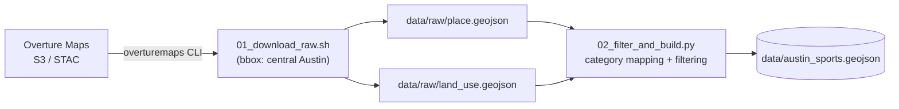
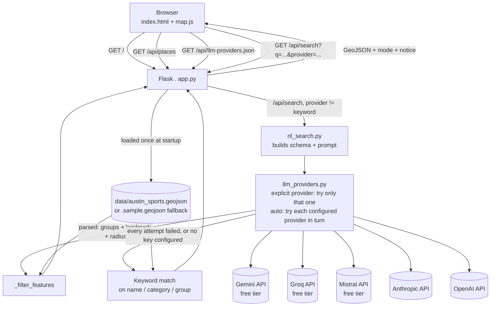

# Architecture

Two separate flows: a one-time offline data pipeline that produces the file the app ships, and the live request flow that serves it. Both are small on purpose, see the README's "What I deliberately cut" for why.

## Data pipeline (offline, one-time)

Run by hand via `make extract` (or `scripts/01_download_raw.sh` + `scripts/02_filter_and_build.py` directly). Not part of the running app; its only output the app depends on is `data/austin_sports.geojson`.

`02_filter_and_build.py` maps Overture's raw category taxonomy onto this app's smaller set of activity groups (see `CATEGORY_GROUPS` in `app.py`), drops anything that isn't a real public sport/rec spot (gyms, sporting goods stores, sports bars, and the like), and marks each feature `details_limited` when it has no address, phone, or website, most `land_use` polygons, since they're shapes with no attributes.

## Runtime (serving a request)

Points worth calling out:

- **One in-memory dataset.** `app.py` loads `data/austin_sports.geojson` once at process start; `/api/places` and `/api/search` both filter that same list in memory, there's no database.
- **The LLM path always has a landing pad.** `/api/search` never returns a hard error for an AI failure, no provider configured, a bad key, a rate limit, every provider timing out, all degrade to the keyword matcher, with a `notice` field in the response telling the frontend (and the user) that a fallback happened.
- **Provider choice is a request, not just a server setting.** The `provider` query param (driven by the search bar's picker) can request one specific provider by name, `auto` to chain through every configured one (free ones first: Gemini, Groq, Mistral, then Anthropic, OpenAI), or `keyword` to skip AI outright. With no `provider` param at all, the server behaves as `auto`. `LLM_PROVIDER` in `.env` overrides what `auto` resolves to.
- **Gemini gets its own retry.** Google's free-tier Flash models return intermittent 503s under load; `_extract_gemini` retries once against a sibling Flash model (`gemini-3.5-flash-lite`) before treating Gemini as failed, on top of the cross-provider fallback above. See `llm_providers.py`'s `REQUEST_TIMEOUT_SECONDS` / `GEMINI_TIMEOUT_SECONDS`, that's what keeps a slow or overloaded provider from hanging the request instead of failing over promptly.
- **Free isn't automatically slow.** With all three free providers configured and measured directly: Groq and Mistral both returned a parsed result in under 2 seconds, while Gemini's structured-output calls ranged from about 10 to 35 seconds even when they succeeded, which is the actual reason Gemini gets a longer timeout than the other providers, not just its "high demand" errors.

## Frontend

`map.js` renders one GeoJSON result set (from `/api/places` or `/api/search`) into two synchronized views:

- **Map**: a Leaflet layer, pins for `Point` features, outlined shapes for `Polygon`/`MultiPolygon` land-use features.
- **List**: the same features as cards, built from the same `buildSpotHtml()` used for the map's popups, so the two views never drift apart.

Clicking a list card switches to map view and opens that spot's popup; clicking a category filter, "Use my location", or submitting the search box all reset to a fresh `/api/places` or `/api/search` fetch.

See [screenshots](screenshots/) for both views and the search bar's AI-parsed result, or the README's [Screenshots](../README.md#screenshots) section for the same, inline.
